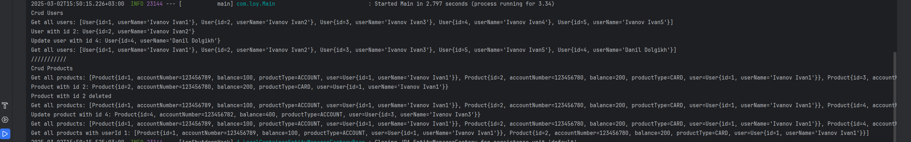
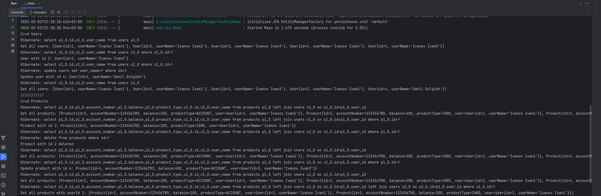

Доработайте сервис, пусть теперь он хранит продукты клиентов.

Хранение продуктов необходимо организовать аналогично ранее добавленным пользователям.

У каждого пользователя может быть несколько продуктов, но у каждого продукта один пользователь.

Продукт клиента: id, номер счета, баланс, тип продукта (счет, карта), userId.

Сервис должен хранить продукты.

Сервис должен давать возможность: запросить все продукты по userId, запросить продукт по productId.

Все изменения в БД выполняются через инструмент миграции, добавленный ранее
 
Скрин консоли: 


Скрин консоли с ```  jpa:
show-sql: true```: 
