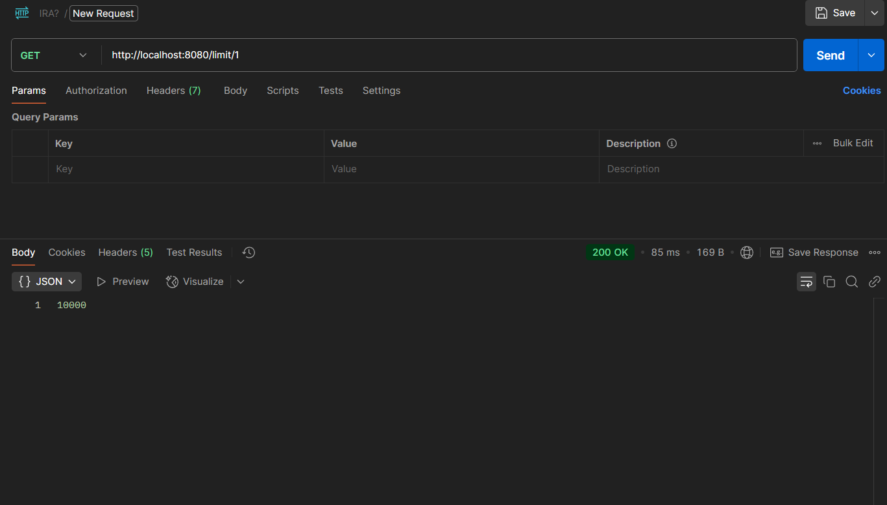
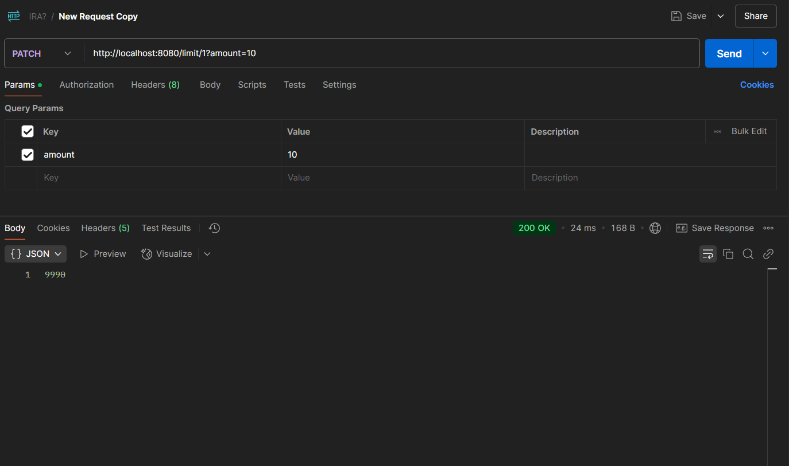
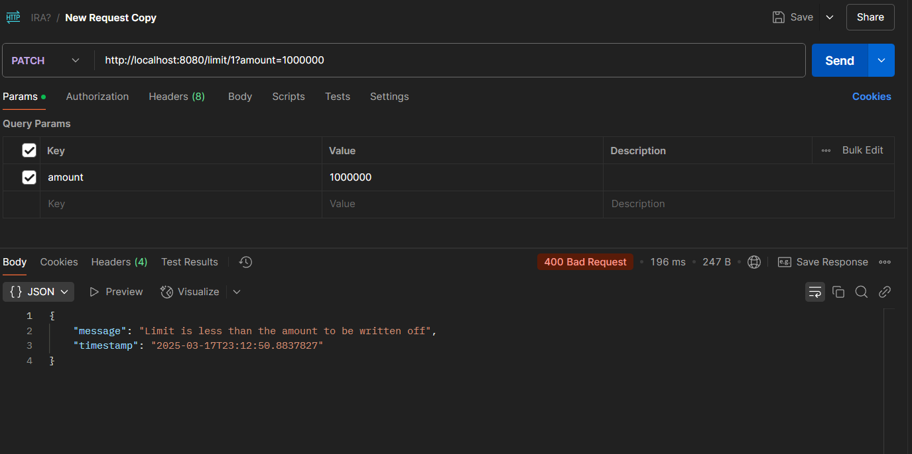

Реализовать REST микросервис лимитов, который имеет следующих функционал:

- Для каждого юзера в БД хранится дневной лимит возможных платежей (первоначально 10000.00. Считаем, что раз в несколько месяцев он может меняться)

- В 00.00 каждого дня лимит для всех пользователей должен быть сброшен

- Про успешном проведении платежа лимит должен быть уменьшен на соответствующую сумму

- Если вдруг платеж по какой-то причине не прошел, необходимо иметь возможность восстановить списанный лимит (тут сами выбираете стратегию уменьшения/восстановления лимитов)

- Поскольку сервиса клиентов у нас нет, в БД храним лимиты для «клиентов» с ID 1-100

- Поскольку считаем, что gateway не пропустит в систему несуществующего клиента, то при запросе лимита с ID, который отсутствует в БД, создаем новую запись под него со стандартным значением лимита

Для запуска postgres необходимо выполнить команду из директории проекта: 
```
docker-compose up
```

Далее запустить сервис

Для тестирования можно использовать следующие запросы:
- снять лимит 
```
curl --location --request PATCH 'http://localhost:8080/api/v1/limit/user/1?amount=10'
```
- запросить лимит пользователя по userId
```
curl --location 'http://localhost:8080/api/v1/limit/user/1'
```

Скрины из Postman:



Пример запросов с ошибками:


PaymentRemoteMockService - сервис для имитации прохождения платежа с вероятностью 50%