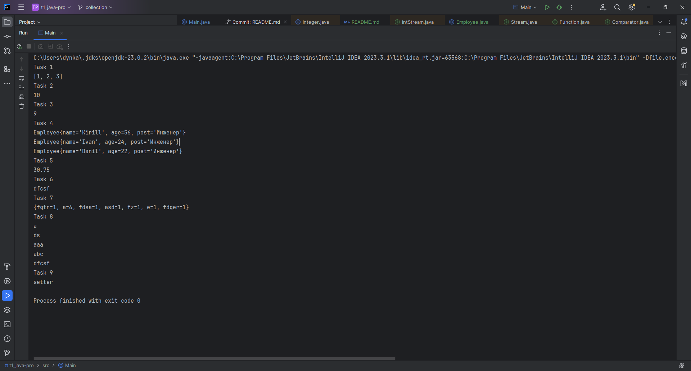

Все задачи должны быть выполнены в одну строку.

Task 1:  Реализуйте удаление из листа всех дубликатов

Task 2:  Найдите в списке целых чисел 3-е наибольшее число (пример: 5 2 10 9 4 3 10 1 13 => 10)

Task 3:  Найдите в списке целых чисел 3-е наибольшее «уникальное» число (пример: 5 2 10 9 4 3 10 1 13 => 9, в отличие от прошлой задачи здесь разные 10 считает за одно число)

Task 4:  Имеется список объектов типа Сотрудник (имя, возраст, должность), необходимо получить список имен 3 самых старших сотрудников с должностью «Инженер», в порядке убывания возраста

Task 5:  Имеется список объектов типа Сотрудник (имя, возраст, должность), посчитайте средний возраст сотрудников с должностью «Инженер»

Task 6:  Найдите в списке слов самое длинное

Task 7:  Имеется строка с набором слов в нижнем регистре, разделенных пробелом. Постройте хеш-мапы, в которой будут хранится пары: слово - сколько раз оно встречается во входной строке

Task 8:  Отпечатайте в консоль строки из списка в порядке увеличения длины слова, если слова имеют одинаковую длины, то должен быть сохранен алфавитный порядок

Task 9:  Имеется массив строк, в каждой из которых лежит набор из 5 строк, разделенных пробелом, найдите среди всех слов самое длинное, если таких слов несколько, получите любое из них

Результат представлен на скрине:
